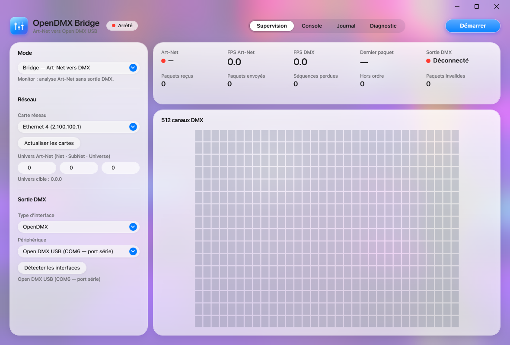
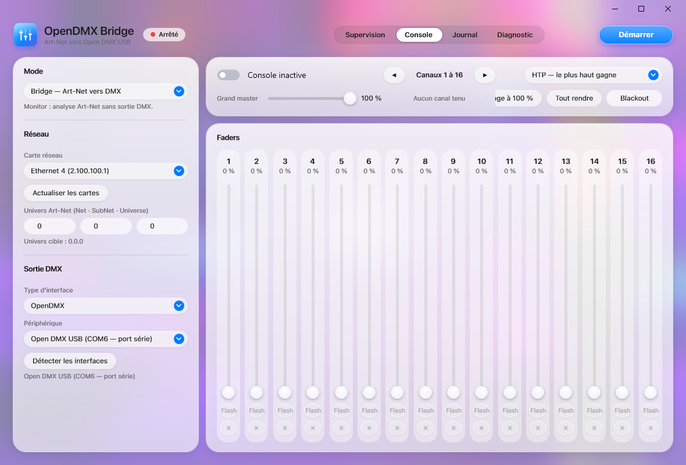

<div align="center">


# OpenDMX Bridge

**Passerelle Art-Net → Open DMX USB pour Windows, avec micro console DMX intégrée.**

Reçoit l'Art-Net de votre logiciel lumière (grandMA2 onPC, QLC+, Daslight…) et pilote un boîtier
Open DMX USB (FTDI FT232R) à 40 trames par seconde, dans une interface façon macOS « Liquid Glass ».

[](https://github.com/naileclevrai/Open-Dmx-Bridge/releases)
[](LICENSE)
[](https://dotnet.microsoft.com/download/dotnet/8.0)
[](#stack)
[](#prérequis)
[](https://github.com/naileclevrai/Open-Dmx-Bridge/commits/main)
[](https://github.com/naileclevrai/Open-Dmx-Bridge/commits/main)
[](https://github.com/naileclevrai/Open-Dmx-Bridge/issues)

[Fonctionnalités](#fonctionnalités) ·
[Captures](#captures-décran) ·
[Installation](#installation) ·
[Utilisation](#utilisation) ·
[Console DMX](#micro-console-dmx) ·
[Dépannage](#dépannage) ·
[Architecture](#architecture) ·
[Contribuer](#contribuer)

</div>

---

## Fonctionnalités

<table>
<tr>
<td width="50%" valign="top">

### 🌐 Réception Art-Net
- Écoute UDP 6454 (paquets **ArtDMX**)
- Choix de la carte réseau (bind sur l'IP locale)
- Filtrage **Net · SubNet · Universe**
- Statistiques : FPS, paquets reçus, invalides, séquences perdues, hors ordre
- Détection du timeout (LED rouge après 2 s sans paquet)

### 🔌 Sortie Open DMX USB
- Boîtiers Enttec Open DMX USB et compatibles FTDI (Electroconcept, etc.)
- Pilote **D2XX** (contrôle direct du break) ou **port COM** en secours
- Trames complètes garanties : attente de fin d'émission avant chaque break
- Break / MAB réglables, 40 trames/s
- Reconnexion USB automatique

</td>
<td width="50%" valign="top">

### 🎛️ Micro console DMX
- 16 faders paginés sur les 512 canaux
- Fusion **HTP** (le plus haut gagne) ou **Override** (la console écrase)
- Grand master, **Flash** par canal, **Blackout**
- Chaque canal « tenu » peut être rendu au flux Art-Net d'un clic

### 🖥️ Interface
- Style macOS **Liquid Glass** : flou système Acrylic, verre translucide, capsules
- Police SF Pro si installée (repli Segoe UI)
- Animations : indicateur d'onglet glissant, transitions, boutons réactifs
- Moniteur temps réel des 512 canaux
- Journal exportable, diagnostic, journal de crash sur disque

</td>
</tr>
</table>

---

## Captures d'écran

<div align="center">

**Supervision** — statistiques Art-Net/DMX et moniteur 512 canaux



<br><br>

**Console** — 16 faders, master, Flash, Blackout, fusion HTP/Override



</div>

---

## Installation

### Prérequis

| Composant | Détail |
|---|---|
| **Système** | Windows 10 ou 11, 64 bits (le flou Acrylic nécessite Windows 11 22H2+, sinon fond dégradé) |
| **Runtime** | [.NET 8 Desktop Runtime](https://dotnet.microsoft.com/download/dotnet/8.0) |
| **Pilote** | [FTDI D2XX / VCP (CDM)](https://ftdichip.com/drivers/d2xx-drivers/) — installé automatiquement par Windows Update dans la plupart des cas |
| **Matériel** | Boîtier Open DMX USB (puce FTDI FT232R, VID `0403` / PID `6001`) |

> [!NOTE]
> `FTD2XX.dll` est copiée à côté de l'exécutable au build si elle est présente dans `System32`.
> Sinon, l'application fonctionne via le port COM (pilote VCP) ou en mode **Monitor**.

### Compiler depuis les sources

```powershell
git clone https://github.com/naileclevrai/Open-Dmx-Bridge.git
cd Open-Dmx-Bridge
dotnet build src/OpenDMXBridge/OpenDMXBridge.csproj -c Release
```

Binaire : `src/OpenDMXBridge/bin/Release/net8.0-windows/OpenDMXBridge.exe`

---

## Utilisation

1. Branchez le boîtier Open DMX USB.
2. Lancez **OpenDMX Bridge** *avant* votre logiciel lumière (voir [Dépannage](#dépannage)).
3. Choisissez la carte réseau sur laquelle arrive l'Art-Net.
4. Réglez l'univers cible (`Net.SubNet.Universe`, par défaut `0.0.0`).
5. Vérifiez le périphérique détecté dans **Sortie DMX**, puis cliquez **Démarrer**.

La pastille **Art-Net** passe au vert dès que des paquets arrivent ; **Sortie DMX** indique « Connecté »
quand le boîtier est ouvert. Le moniteur affiche les 512 canaux en temps réel.

### Modes

| Mode | Description |
|---|---|
| **Bridge** | Art-Net → sortie DMX physique (usage normal) |
| **Monitor** | Analyse du flux Art-Net sans sortie DMX |

---

## Micro console DMX

L'onglet **Console** ajoute une couche locale fusionnée dans la trame sortante.

| Élément | Rôle |
|---|---|
| **Console active** | Tant que l'interrupteur est éteint, la console n'a aucun effet |
| **Faders 1–16** | Un canal touché devient « tenu » et s'applique ; `×` le rend à l'Art-Net |
| **◀ ▶** | Pagination par 16 canaux (1–16, 17–32, …, 497–512) |
| **HTP / Override** | HTP : la valeur la plus haute gagne. Override : la console écrase l'Art-Net |
| **Grand master** | Atténue tous les canaux tenus (0–100 %) |
| **Flash** | Canal à 100 % tant que le bouton est maintenu, puis retour au niveau précédent |
| **100 %** / **Tout rendre** | Toute la page à 100 % / libère tous les canaux de la console |
| **Blackout** | Toute la trame à zéro, Art-Net compris |

> [!TIP]
> La page affichée, le grand master et le mode de fusion sont mémorisés.
> L'activation de la console ne l'est jamais : l'application démarre toujours avec l'Art-Net seul.

---

## Dépannage

<details>
<summary><b>« Impossible d'ouvrir … : le boîtier est déjà utilisé par un autre logiciel »</b></summary>

Un seul programme peut tenir le port FTDI. **grandMA2 onPC**, QLC+, Daslight ou un moniteur série
l'ont probablement ouvert. Fermez-le, ou lancez OpenDMX Bridge **avant** ce logiciel : une fois le
port tenu par le Bridge, l'autre programme ne pourra plus le prendre et enverra son Art-Net normalement.

Pour vérifier depuis un terminal :

```powershell
dotnet run --project tools/FtdiProbe -c Release
```

`flags=0x1` signifie « déjà ouvert par un autre processus » ; `flags=0x0` et `FT_Open => 0` signifient libre.
</details>

<details>
<summary><b>Le projecteur clignote</b></summary>

Une trame DMX complète dure 22,6 ms. L'application attend la fin d'émission de chaque trame avant le
break suivant et plafonne le rafraîchissement à 40 Hz. Si un clignotement persiste, vérifiez le câble
XLR, la terminaison de ligne et l'adresse du projecteur.
</details>

<details>
<summary><b>Aucun périphérique détecté</b></summary>

- Gestionnaire de périphériques → *Ports (COM et LPT)* doit lister **USB Serial Port (COMx)**
  et *Contrôleurs de bus USB* → **USB Serial Converter**. Les deux sont normaux et coexistent.
- Cliquez **Détecter les interfaces**.
- Réinstallez le pilote FTDI CDM si besoin.
</details>

<details>
<summary><b>L'application ne s'ouvre pas</b></summary>

Consultez `%LOCALAPPDATA%\OpenDMXBridge\crash.log` : toute exception non gérée y est écrite avec sa pile d'appels.
Les réglages sont dans `%LOCALAPPDATA%\OpenDMXBridge\settings.json`.
</details>

---

## Architecture

```
UI (WPF · MVVM · CommunityToolkit)
 │
 ├── SettingsService          réglages JSON (%LOCALAPPDATA%\OpenDMXBridge)
 ├── ArtNetNetworkService     UDP 6454, parsing ArtDMX, statistiques
 ├── DmxEngine                buffers d'univers atomiques, horloge 40 Hz
 │    └── DmxConsoleLayer     micro console : canaux tenus, master, HTP/Override
 ├── IDmxOutput
 │    ├── OpenDmxOutput       FTDI D2XX ou port COM, break/MAB, garde de fin de trame
 │    ├── NullDmxOutput       mode Monitor
 │    └── EnttecPro · DMXKing · sACN · ArtNet   (ébauches)
 ├── LoggingService           journal mémoire + export, crash.log sur disque
 └── BridgeOrchestrator       démarrage/arrêt, connexion différée du boîtier
```

### Points de fiabilité

- **Double buffer atomique** entre le thread réseau et le moteur DMX (`Interlocked.Exchange`)
- **Garde de fin de trame** : 513 octets à 250 kbauds = 22,6 ms ; aucun break n'est émis avant, plus vérification du tampon TX en D2XX
- **Horloge** Stopwatch avec correction de dérive, plafonnée à 40 Hz
- **FTD2XX.dll chargée dynamiquement** : l'application démarre sans la DLL
- **Arrêt propre** : le socket UDP est fermé avant d'attendre la boucle de réception
- **Zéro allocation** dans les boucles réseau et DMX

Détails des timings DMX512 : [docs/DMX_TIMING.md](docs/DMX_TIMING.md).

### Stack

| | |
|---|---|
| Langage | C# 12 · .NET 8 LTS (Windows x64) |
| UI | WPF · [ModernWpfUI](https://github.com/Kinnara/ModernWpf) · [CommunityToolkit.Mvvm](https://github.com/CommunityToolkit/dotnet) |
| USB | FTDI D2XX (`FTD2XX.dll`) via `NativeLibrary`, `System.IO.Ports` en secours |
| Flou système | `DwmSetWindowAttribute(DWMWA_SYSTEMBACKDROP_TYPE)` |

### Outils

| Dossier | Usage |
|---|---|
| `tools/FtdiProbe` | Sonde D2XX + COM : détection, flags, ouverture, trame de test |
| `tools/ComOnlyTest` | Ouverture du port COM seul |
| `tools/MakeIcon` | Génération de l'icône (PNG + ICO) via `make-icon.ps1` |

---

## Feuille de route

- [ ] sACN (E1.31), Enttec USB Pro, DMXKing
- [ ] Multi-univers et mapping
- [ ] Enregistrement / lecture de séquences
- [ ] Mode sombre
- [ ] Installeur et mise à jour automatique

---

## Contribuer

Les issues et pull requests sont bienvenues.

- Commits en français, préfixés `feat:`, `fix:`, `ui:`, `style:`, `anim:`, `build:`, `docs:`.
- Un commit par changement ; le projet doit compiler à chaque commit.
- Testez sur du vrai matériel quand le changement touche la sortie DMX.

---

## Licence

Distribué sous licence **Apache 2.0**. Voir [LICENSE](LICENSE) et [NOTICE](NOTICE) pour les composants tiers.

<div align="center">
<sub>Fait pour les régisseurs lumière qui veulent brancher un boîtier à 30 € sur une console à 30 000 €.</sub>
</div>
